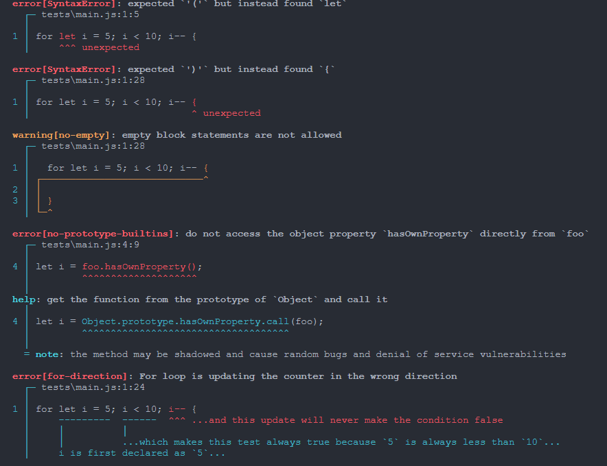

# Formatters

Formatters are structures which take in raw diagnostics and render them in some way. RSLint provides a few natively implemented
formatters which allow you to configure how errors are shown in the terminal.

RSLint errors natively include a myriad of data inside of them including rule name, named labels, notes, suggestions, etc. However,
rendering full diagnostics generally takes a lot of space, therefore shorter options for rendering are provided.

You can configure which formatter RSLint uses through the `errors` key in the config:

```toml
[errors]
formatter = "short"
```

Alternatively you can also use the `--formatter` and `-F` flags through the CLI:

```
rslint_cli ./foo --formatter short
```

```
rslint_cli ./foo -F short
```

CLI options will override any config options.

The default `long` formatter will be used if you do not specify one or it is invalid.

## Long

This is the default formatter used if you do not configure an alternate one. It is also the most verbose, as it shows all info included in the diagnostics, it is helpful for learning how to fix an issue but may be distracting if there are a lot of errors.

Here is an example of the output with the following code and configuration:

```js
for let i = 5; i < 10; i-- {

}
let i = foo.hasOwnProperty();
```

```toml
[rules]
groups = ["errors"]

[rules.warnings]
no-empty = {}
```



## Short

This is a minimal formatter which you may be familiar with if you use ESLint. It only shows the message, code, and location.


# Note

Note however that the order of diagnostics is not guaranteed and it usually changes across linting runs, therefore you should not rely on the raw output. This is because files and rules are run in parallel and the order of linting is not guaranteed for now.
