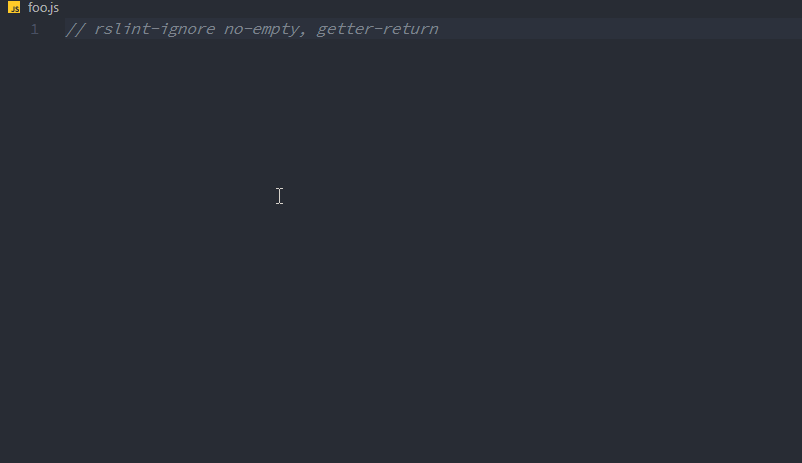

# v0.3.0

{Date}

**Commit**: xxxxxx

**Release**: xxxxx

## New Features

### TypeScript support

RSLint will now automatically detect `.ts` files and lint them. The parser also received
changes to parse TypeScript and issue early errors for when TypeScript is attempted to be used in JavaScript files

### Other features

- The CLI now produces consistent exit codes:
  `-1`: Linting was unsuccessful because of an internal error
  `0`: Linting was successful and there are no errors (but there may be warnings)
  `1`: Linting was successful and there is at least one error
  `2`: Linting could not be done because of a config or CLI error (e.g. invalid glob pattern)

- The CLI now accepts multiple glob patterns instead of only one

- Added an alternative formatter called "short" for diagnostics similar to ESLint:


- Added a way to configure the formatter through the cli using `-F` or `--formatter`

- Added a way to configure the formatter through the config using the `errors` key:

```toml
[errors]
formatter = "short"
```

- Added the `infer` subcommand to infer style for the project and output style rules to match it

- Added the `rules` subcommand to show all rules

- Reduced memory usage significantly by switching to an alternative backing for syntax nodes

- Directives now provide info upon hover:



## Changes

- The CLI's binary is now `rslint` instead of `rslint_cli`

## Fixes

- Fixed `/\u{0}/ª\u{80}` panicking
- Fixed `switch {` infinitely recursing
- Fixed infinite recursion with

```js
try{}
catch(){
finally{}
```

- Fixed "redundant strict mode declaration" having a single secondary label instead of a primary label.

## Internal improvements

### Core

- Added `util::StyleExt` for stylistic linting
- Added `Fixer::delete_multiple`
- Added more functions to `util::StyleExt`
- Added `RuleCtx::dummy_ctx`
- Added `Inferable` to define rules which can have their options inferred from nodes
- Added benchmarks for linting a file
- Moved util from a file to its own directory
- Switched to an alternative way of parsing directives using predefined instructions and a custom "parser"

### CLI

- Made all fields of config public
- Added the `rules` subcommand to show all available rules
- Added `JsFile::parse`
- Changed the parameters of `FileWalker::from_glob` from `Paths` to a generic `IntoIterator`
- Added the `infer` function
- Added `-Z` developer flags (`dumpast`, `tokenize`, `help`)
- Moved config handling to `rslint_config`

### Parser

- Added `util::contains_js_whitespace`
- Made `cur_event_pos` and `token_pos` private in favor of a specialized checkpoint struct
- Changed `rewind` to take a Checkpoint
- Added `Syntax` to specify file syntax
- Added `syntax::typescript`
- Added the `stop_on_r_curly` parameter to `block_items`
- Added a new parameter to `Parser::new`
- Fixed `parse_marker` panicking on preceded markers which are later abandoned
- Added a Checkpoint struct to easily backtrack (rewind) the parser

### LSP

- Added hover info for directives
